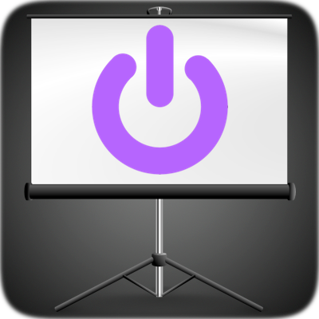
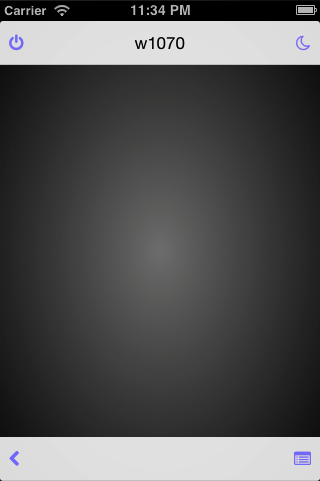

# Projo

A server and mobile web app I made to control my video projector without a
remote.

I can now switch the projector on/off, easily set the 3d mode, navigate the menu and blank the screen
using my phone (or other web-enabled device).

My current setup is a [Benq
W1070](http://www.benq.com/product/projector/w1070/) projector that is linked to
a [TP-Link TL-MR3020](http://wiki.openwrt.org/toh/tp-link/tl-mr3020) wireless device via
a RS-232 cable. Additionally a 12V trigger cable has been wired between the projector and
the motorized screen so the screen is now automatically controlled by the
projector (no more remote either).

This device delivers a RESTful web-service as an interface to the video
projector via serial commands (Crestron protocol) and a web app that I use
on my mobile devices to replace the remote.

I made it to fit my own needs but it should pretty much work out of the box for
other devices (any \*nix running computer with a RS232 connector) and the
Crestron protocol seems to be common to multiple brand of AV equipment.

A version made for the Raspberry Pi (or other "generic" \*nix for that matter)
is available in it's own branch.

## Software

 * OS: [OpenWRT](https://openwrt.org)
 * Web Server: [LuCI](http://luci.subsignal.org/trac)
 * Web App: [AngularJS](http://angularjs.org)

[Bonjour](http://en.wikipedia.org/wiki/Bonjour_%28software%29) is used for
auto-discovery so I just need to go the http://projo.local/projo url on my mobile
devices and optionally add the App to the Home Screen.

Once launched there is a few buttons on the top and bottom. The dark area in
the center is a gesture interface to the menu. Swipe left/right/up/down
navigate in the menu, a tap select an item. The back button goes back one level.

AngularJS has been selected because I needed an excuse to play with it. It's used
in conjunction with [CoffeeScript](http://coffeescript.org), [Compass](http://compass-style.org), [Yeoman](http://yeoman.io), [Grunt](http://gruntjs.com) and [Bower](http://bower.io).

The server side part is now in Lua (from Python) to drastically reduce the
footprint needed. It went from ~150M to ~150K. It's also now packaged as a
native Opkg package.

## Hardware

Serial cable on projector below ceiling...

...that goes upstairs to the device

TTL to RS232 board and wiring

The base block is a TP-Link TL-MR3020 router. I selected it for the following
reasons: it's cheap, runs OpenWRT, has UART pins readily accessible, enough
(albeit barely) room inside to fit the serial board and did I mention it's cheap? 

It's comparable in price to the Raspberry Pi but comes with wifi, internal
storage (incredibly small), a case and a power supply.

The board is a simple [MAX232](http://en.wikipedia.org/wiki/MAX232) based TTL
to RS232 adapter. The UART on the router works at 3.3V so the MAX232 converts
it to signals compatible with other RS232 devices. You can find them on eBay
for a pittance by searching for "TTL to RS232".

Wiring is simple:

* 5V pad from the router goes to the 5V on the board (I added hot-glue to secure
  it after soldering)
* Ground from the router goes to the ground pin on the board
* RX on the router goes to TX on the board
* TX on the router goes to RX on the board

And that's pretty much it, drilling the holes in the case took longer.

Here is the pinout on the router: [MR3020 pins](http://wiki.openwrt.org/_detail/media/tp-link_mr3020_top-pcb-gpio-pins.jpg?id=toh%3Atp-link%3Atl-mr3020).
I did add a 10K pull-up resistor between VCC and TX as recommended on the
documentation but I'm not sure if it's necessary.

Do note that you'll need a straight DB9<->DB9 male-female cable (or you'll
spend a few days wondering why it doesn't work with a null-modem cable, not
that it happened to me...).

## Installation

An [opkg](http://wiki.openwrt.org/doc/techref/opkg) file is provided for easy
installation and there is a detailed [installation guide](INSTALL.md) that 
covers the setup needed to get it up and running (mostly base OpenWRT setup
information).
